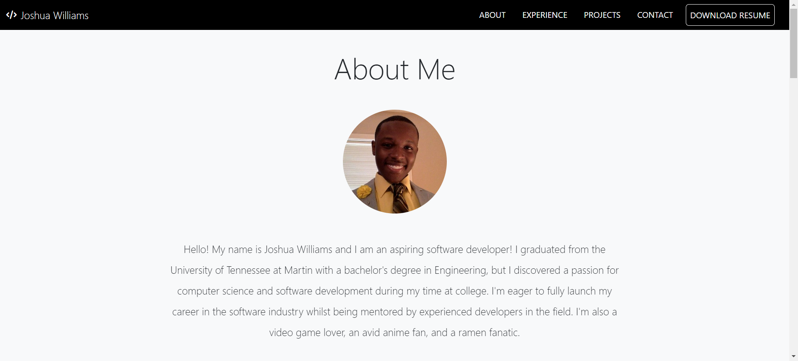

# professional-portfolio

## Description

My professional portfolio is built entirely from scratch using the core front-end technologies (HTML, CSS, JavaScript) and the bootstrap framework to ensure a nice, responsive UI. This poject is intended to showcase my personal profile, technical skills, projects, and contact information to potential employers.

Deployed Application: [Professional Portfolio](https://codehashira28.github.io/professional-portfolio/)

## Installation

N/A

## Usage

Navigation links for each section can be clicked and the page will scroll to that section.

## Credits

Drew design inspiration from example portflios found online and tailored by my personal touch and experiences.